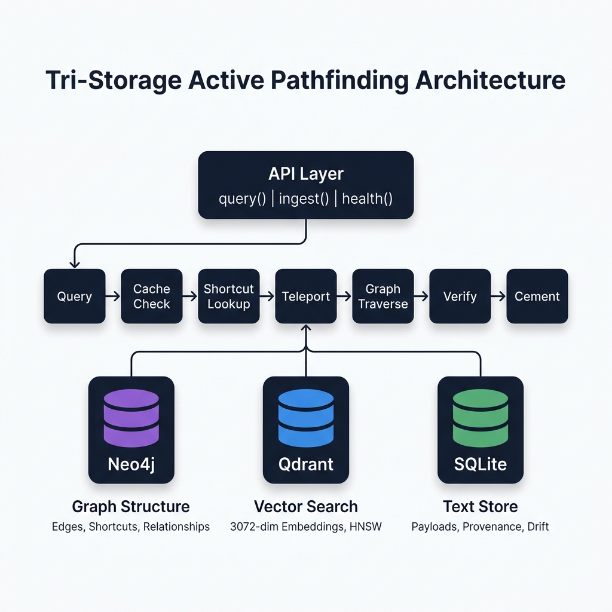
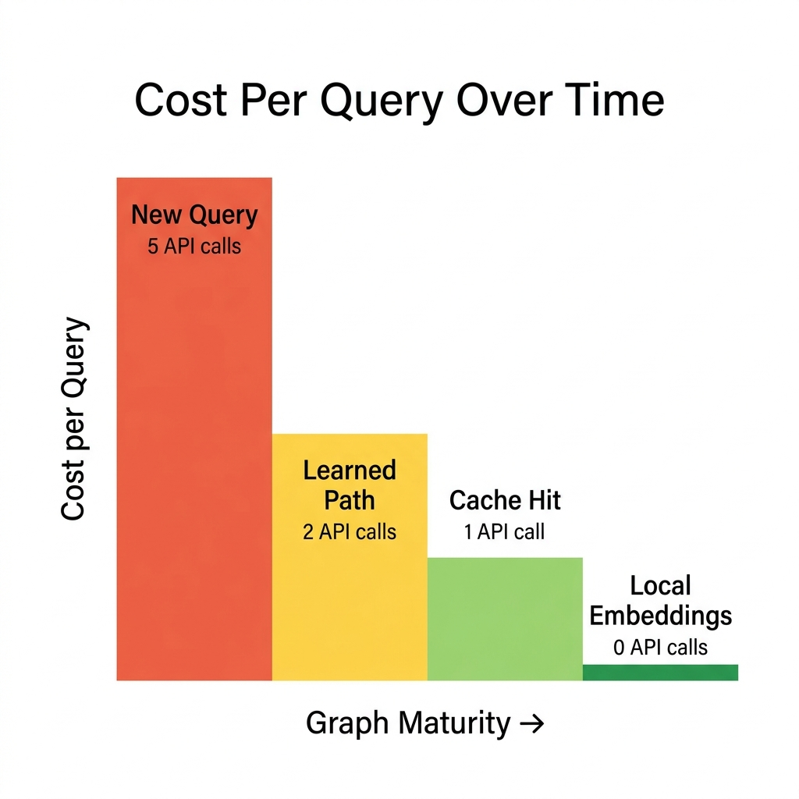
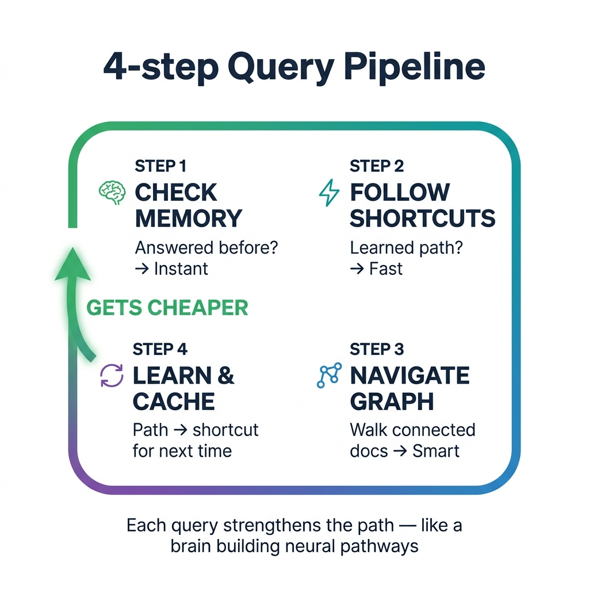

<p align="center">
  
</p>

<h1 align="center">NeuroPlastic Memory</h1>

<p align="center">
  <strong>A graph-based AI memory module that learns from every query — like a brain building neural pathways.</strong>
</p>

<p align="center">
  
  
  
  
  
</p>

---

## The Problem

**Vanilla RAG is stateless.** Every query dumps a flat list of "top-K similar chunks" into the prompt — no understanding of *how* documents connect, no memory of what worked before, and no way to improve over time. As knowledge bases grow, retrieval quality degrades and API costs scale linearly.

## The Solution

**NeuroPlastic Memory** replaces flat vector search with an **Active Pathfinding** algorithm that navigates a knowledge graph. It learns from every query — successful traversal paths become shortcuts (like synapses strengthening in a brain), making future queries faster, cheaper, and more accurate.

```
First query:   5 API calls  →  10s
Learned path:  2 API calls  →  4s
Cache hit:     1 API call   →  0.5s
```

<p align="center">
  
</p>

---

## How It Works

<p align="center">
  
</p>

Every query flows through a **cost-optimized pipeline** — each step is a gate that exits at the cheapest possible level:

| Step | What Happens | API Calls | When |
|------|-------------|-----------|------|
| **1. Check Memory** | Semantic cache lookup (cosine similarity) | 0 | Repeat/similar queries |
| **2. Follow Shortcuts** | HNSW search for learned edges | 0 | Previously answered queries |
| **3. Navigate Graph** | LLM-guided traversal with backtracking | 2-4 | New questions |
| **4. Learn & Cache** | Cement successful path as shortcut | 0 | After every successful query |

The system uses a **tri-storage architecture**: Neo4j for graph structure, Qdrant for vector embeddings, and SQLite for text payloads and provenance tracking.

---

## Quick Start

### Prerequisites

```bash
# Start the required databases
docker run -d -p 7474:7474 -p 7687:7687 -e NEO4J_AUTH=neo4j/password neo4j
docker run -d -p 6333:6333 qdrant/qdrant
```

### Installation

```bash
git clone https://github.com/SANYAM-PANSARI/Neuroplastic-Memory.git
cd neuroplastic-memory
pip install -e ".[dev]"

# Configure
cp .env.example .env
# Edit .env with your API key (e.g., GEMINI_API_KEY)
```

### Usage

```python
import asyncio
from context_memory import query, ingest, close

async def main():
    # Ingest a document or directory
    result = await ingest("./my_docs/", dataset_id="my-project")
    print(f"Ingested {result.chunks_created} chunks")

    # Query with active pathfinding
    ctx = await query("How does authentication work?", dataset_id="my-project")
    print(ctx.chunks)         # Retrieved text chunks
    print(ctx.confidence)     # Confidence score
    print(ctx.sources)        # Source file paths

    # Second time is faster — learned shortcuts kick in
    ctx2 = await query("What auth method is used?", dataset_id="my-project")
    print(ctx2.traversal_metadata["status"])  # "shortcut" or "cache_hit"

    await close()

asyncio.run(main())
```

---

## Key Features

### 🧠 Neuroplastic Learning
Successful query paths are cemented as **SEMANTIC_LENS** edges in the graph — weighted shortcuts that strengthen with use (capped at 5.0). The system literally gets smarter over time.

### ⚡ Cost-Optimized Pipeline
Queries exit at the cheapest possible level. A mature graph handles most queries with 1-2 API calls instead of 5+. Cache hits cost zero LLM calls.

### 🔌 Provider Agnostic
All LLM calls route through [LiteLLM](https://github.com/BerriAI/litellm). Switch between Gemini, Claude, GPT, or local models by changing a single `.env` variable:
```bash
PATHFINDER_MODEL=gemini/gemini-2.5-flash-preview-05-20  # Google
PATHFINDER_MODEL=anthropic/claude-sonnet-4-20250514    # Anthropic
PATHFINDER_MODEL=ollama/llama3                 # Local
```

### 🗄️ Tri-Storage Architecture
| Database | Role | Data |
|----------|------|------|
| **Neo4j** | Graph structure | Nodes, edges, learned shortcuts, traversal metadata |
| **Qdrant** | Vector search | 3072-dim embeddings (HNSW index), shortcut vectors |
| **SQLite** | Text storage | Full text payloads, provenance, drift scores |

### 🔒 Anti-Hallucination
The framework returns **verbatim source chunks**, never generated text. A verification step validates retrieved content against the query before returning results. Proven paths (edge weight ≥ 2.0) skip verification — trust is earned.

### 📊 Transparent Cost Tracking
Every query response includes `traversal_metadata` with the exact number of LLM calls, hops taken, nodes visited, and the traversal status.

---

## Configuration

All settings are managed via `.env` (see [.env.example](.env.example)):

| Variable | Default | Description |
|----------|---------|-------------|
| `GEMINI_API_KEY` | — | Required. API key for LLM provider |
| `PATHFINDER_MODEL` | `gemini/gemini-2.5-flash-preview-05-20` | Model for graph navigation decisions |
| `SUMMARIZER_MODEL` | `gemini/gemini-2.5-flash-preview-05-20` | Model for text summarization |
| `VERIFIER_MODEL` | `gemini/gemini-2.5-flash-preview-05-20` | Model for anti-hallucination verification |
| `EMBEDDING_MODEL` | `gemini/text-embedding-005` | Embedding model (supports local models too) |
| `NEO4J_URI` | `bolt://localhost:7687` | Neo4j connection |
| `QDRANT_URL` | `http://localhost:6333` | Qdrant connection |
| `SQLITE_PATH` | `./data/memory.db` | SQLite database path |
| `BROAD_QUERY_THRESHOLD` | `0.6` | Score below which queries are treated as broad |
| `MAX_BACKTRACK` | `5` | Max backtracks before escape hatch |
| `EDGE_WEIGHT_CEILING` | `5.0` | Maximum weight for learned edges |

---

## Project Structure

```
neuroplastic-memory/
├── context_memory/              # Core Python package
│   ├── __init__.py              # Public exports: query, ingest, health, close
│   ├── api.py                   # Public API surface
│   ├── config.py                # Pydantic Settings (reads .env)
│   ├── types.py                 # ContextResult, IngestResult, HealthReport
│   ├── agents/
│   │   └── llm.py               # LiteLLM wrappers (provider-agnostic, retries)
│   ├── ingestion/
│   │   ├── chunker.py           # Markdown chunking (header + token fallback)
│   │   └── pipeline.py          # Ingest: chunk → embed → store → summarize → link
│   ├── pathfinding/
│   │   ├── traversal.py         # Active Pathfinding algorithm (the core brain)
│   │   └── cache.py             # Semantic result cache (in-memory, cosine)
│   └── storage/
│       ├── schemas.py           # Pydantic schemas for all 3 stores
│       ├── graph.py             # Neo4j async wrapper
│       ├── vector.py            # Qdrant async wrapper
│       └── relational.py        # SQLite async wrapper
├── tests/
│   ├── smoke_test.py            # Ingestion verification
│   ├── test_query.py            # Single query test
│   ├── test_bulk_ingest.py      # Bulk ingestion test
│   └── test_real_data.py        # Multi-file ingest + 4 query types
├── docs/
│   ├── img/                     # Architecture diagrams
│   └── design/                  # Design documents
├── pyproject.toml               # Package config + dependencies
├── .env.example                 # Configuration template
└── LICENSE
```

---

## Test Results

Tested against 10 design documents (~207 nodes, ~206 edges):

| Query | Result | API Calls | Notes |
|-------|--------|-----------|-------|
| "What databases does the framework use?" | ✅ Found | 3 | Direct hit via graph traversal |
| "How does security address injection?" | ✅ Found | 8 | Deep cross-document traversal |
| "What is the drift-aware decay model?" | ✅ Found | 1 | Broad query — returned summaries |
| "How are edges cemented?" | ✅ Found | 9 | Multi-hop traversal with backtracking |
| *(Repeat of any above)* | ✅ Cache | 1 | Instant — 0.5s response |

---

## Roadmap

- [x] **Tri-storage architecture** — Neo4j + Qdrant + SQLite
- [x] **Active Pathfinding** — Teleport → traverse → verify → cement
- [x] **Neuroplastic learning** — Edge cementing with weight growth
- [x] **Semantic cache** — Cosine similarity, TTL, deep copy safe
- [x] **Cost-optimized pipeline** — Cache → shortcut → broad → traverse
- [ ] **Score-based traversal** — Replace LLM hops with vector math (~5ms/hop)
- [ ] **Temporal decay** — Time-based edge weight decay with drift detection
- [ ] **Visualization frontend** — React + React Flow real-time graph UI
- [ ] **MCP integration** — Tool server for Claude Code / AI agents
- [ ] **Local embeddings** — Eliminate embedding API costs entirely

---

## Architecture Decisions

Key design choices and their rationale:

| Decision | Reasoning |
|----------|-----------|
| **LiteLLM** over direct SDK | Provider-agnostic — switch Gemini↔Claude by changing `.env` |
| **Unified hop prompt** | 1 LLM call per hop (was 2) — merged "evaluate + decide" for cost |
| **Cheapest model for navigation** | Traversal decisions are usually obvious — no need for expensive models |
| **Escape hatch reuses query vector** | No re-embedding on fallback — saves 1 API call |
| **UUIDv5 from content hash** | Deterministic IDs enable deduplication across ingestion runs |
| **MERGE not CREATE** | Prevents duplicate nodes on retry — idempotent writes |

---

## Contributing

See [CONTRIBUTING.md](CONTRIBUTING.md) for setup instructions, code conventions, and how to run tests.

---

## License

This project is licensed under the MIT License — see the [LICENSE](LICENSE) file for details.
